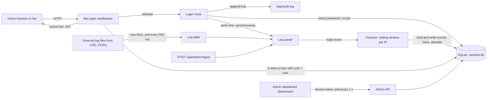

# ARCHITECTURE: Sentinel

One Node.js process does everything: serves the portal login, writes and reads the auth log, detects attacks, stores bans and enforces them. **Enforcement and the ban store live in the same process,** so a ban starts and ends with no polling delay. That is the main design difference from the original, where a separate bouncer polls an API.

## Components

| Component | Responsibility | File (planned) |
|---|---|---|
| **Server** | Creates the Express app, reads config, wires everything | `src/server.js`, `src/app.js` |
| **Config** | Reads env variables with defaults; checks they are valid | `src/config.js` |
| **Clock** | `now()` in ms. Tests replace it with a fake clock so time can be jumped exactly | `src/clock.js` |
| **DB** | Opens SQLite (`node:sqlite`, built into Node 22+), creates tables and indexes, seeds demo users | `src/db.js` |
| **Ban gate** | Middleware run before every portal route: gets the client IP, looks up an active ban, answers 403 if found | `src/banGate.js` |
| **Login route** | Validates input, checks the password, writes the log line, sends it to the parser and detector, picks the response | `src/routes/login.js` |
| **Auth logger** | Appends one line per attempt to `logs/auth.log` | `src/authLog.js` |
| **Log parser** | Turns a log line into `{ at, ip, user, result }` or `null`. Supports our format and sshd | `src/parser.js` |
| **Log tailer** | Follows each file in `LOG_FILES` from its current end, reads new lines, handles truncation | `src/tailer.js` |
| **Detector** | Stores the event; for failures, counts the IP's failures in the window and creates a ban when the threshold is reached | `src/detector.js` |
| **Ban store** | Creates bans (one active per IP), finds active bans, lifts bans, works out escalating duration | `src/bans.js` |
| **Admin API and dashboard** | Token-protected JSON API and a single HTML page that polls it | `src/routes/admin.js`, `public/dashboard.html` |
| **Portal pages** | Login page for the demo | `public/index.html` |

## Configuration (environment variables)

| Variable | Default | Meaning |
|---|---|---|
| `PORT` | `3000` | HTTP port |
| `THRESHOLD` | `10` | Failures inside the window that trigger a ban |
| `WINDOW_SECONDS` | `60` | Length of the sliding window |
| `BAN_DURATION_SECONDS` | `60` | Length of a first ban |
| `ESCALATION` | `true` | The nth ban lasts n × `BAN_DURATION_SECONDS` |
| `MAX_BAN_SECONDS` | `86400` | Cap on any ban's length |
| `ADMIN_TOKEN` | random, printed at startup | Bearer token for `/api/admin/*` |
| `TRUST_PROXY` | `false` | Use `X-Forwarded-For` for the client IP |
| `LOG_FILES` | empty | Comma-separated paths of external logs to follow |
| `TAIL_INTERVAL_MS` | `500` | How often external logs are checked for new lines |
| `DB_PATH` | `data/sentinel.db` | SQLite file (`:memory:` in tests) |
| `AUTH_LOG_PATH` | `logs/auth.log` | Where the portal writes its log |

Every number must be a positive integer, or startup fails with a clear message.

## External services

None. No email, no cloud, no hub download. Everything runs locally.

## Where state lives

| State | Where | Survives restart? |
|---|---|---|
| Users, login events, bans, allowlist | SQLite file `data/sentinel.db` | Yes |
| Auth log | `logs/auth.log` (append only) | Yes |
| Tailer read positions | In memory (each file is read from its end at startup) | No, on purpose: old lines are not replayed at boot |
| Dashboard admin token | Browser `sessionStorage` | Until the tab closes |

**Sliding-window counts are not kept in memory.** They are worked out from the `login_events` table on each failure, so a restart never loses or invents failures.

## Client IP

- By default the client IP is the TCP remote address.
- With `TRUST_PROXY=true`, the first valid address in `X-Forwarded-For` (or, if that header is absent, `X-Real-IP`) is used instead. This is needed behind a reverse proxy, and it is also how a tester on one laptop simulates several IPs.
- The code default is `false`, which is safe when the server is exposed directly, because a client could otherwise fake its IP. `.env.example` sets it to `true` for local testing and the demo.
- IPv4-mapped IPv6 addresses (`::ffff:1.2.3.4`) are normalised to `1.2.3.4`.

## Key decisions and why

| Decision | Why |
|---|---|
| **Sliding window over stored timestamps**, not a leaky bucket | The card says "10 failed logins within a minute". A leaky bucket overflows on capacity + 1 and lets a slow attacker under the leak rate through (see OBSERVATIONS). A window over real timestamps matches the card exactly and can be tested by hand. |
| **Ban is active iff `now < until`, checked on every request** | Gives "lifted exactly when it expires" with no cleanup job and no bouncer polling lag. The original filters active decisions the same way, but enforces through a bouncer that polls. |
| **Unban = set `until` to now**, never delete | Keeps history for the dashboard and for escalation (counting earlier bans). It is the same approach as the original's "expire". |
| **One active ban per IP** | Prevents duplicate rows piling up; the original allows several. |
| **Login route reads its own log line through the parser** | Detection really is driven by log lines (the card says "reads server logs"), and it happens synchronously, so the 10th failure is banned before the response is sent. |
| **The tailer does not read `logs/auth.log`** | That file's lines are already processed by the login route. Reading it again would double count. |
| **SQLite via `node:sqlite`** | Nothing to install or run beyond Node, and the file is easy to inspect. |
| **Injectable clock** | Lets tests check the exact millisecond of expiry without waiting. |
| **Passwords hashed with `crypto.scrypt`** | Built into Node; no plain-text passwords. |
