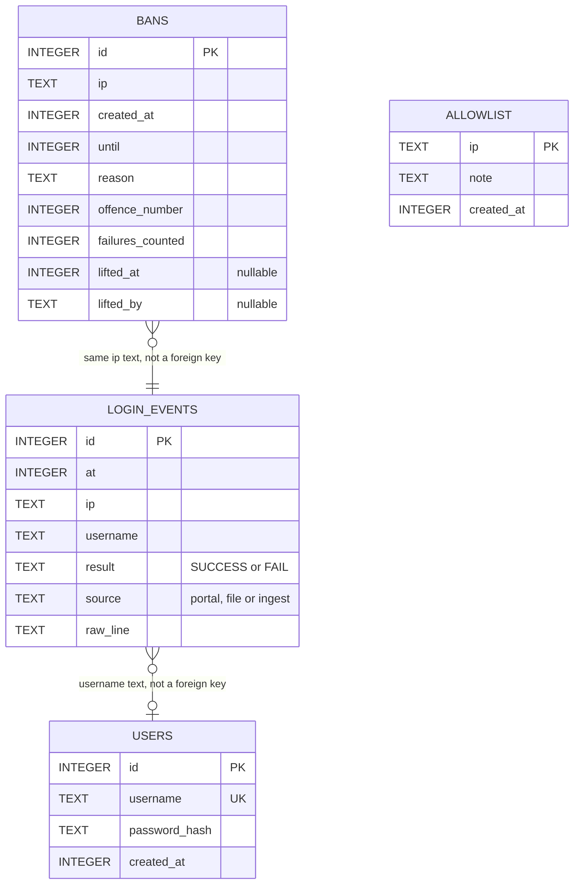

# DATA_MODEL: Sentinel

The database is SQLite (`data/sentinel.db`). Every time is an INTEGER holding **milliseconds since the Unix epoch, UTC**. IPs are TEXT, normalised as described in ARCHITECTURE.md (no `::ffff:` prefix).

Relationships are by value, not by foreign key:
- A login event stores the username that was typed, which may not exist.
- A ban stores the IP; the failures that caused it are found again by IP and time.

## Tables

### users
| Field | Type | Rules |
|---|---|---|
| id | INTEGER | Primary key, autoincrement |
| username | TEXT | **UNIQUE**, NOT NULL, 1–64 characters |
| password_hash | TEXT | NOT NULL. Format `scrypt$<salt hex>$<hash hex>` (16-byte salt, 64-byte key) |
| created_at | INTEGER | NOT NULL |

Seeded at first start with demo users: `student1`, `student2` and `admin_demo`. Their demo passwords are listed in README.md. They are test-only values.

### login_events
| Field | Type | Rules |
|---|---|---|
| id | INTEGER | Primary key |
| at | INTEGER | NOT NULL. Time of the attempt: from the log line if it has a timestamp, otherwise the time it was read |
| ip | TEXT | NOT NULL |
| username | TEXT | May be empty |
| result | TEXT | NOT NULL, CHECK in (`SUCCESS`, `FAIL`) |
| source | TEXT | NOT NULL, CHECK in (`portal`, `file`, `ingest`) |
| raw_line | TEXT | The original log line |

**Index:** `idx_events_ip_result_at (ip, result, at)`. This makes the window count fast.

### bans
| Field | Type | Rules |
|---|---|---|
| id | INTEGER | Primary key |
| ip | TEXT | NOT NULL |
| created_at | INTEGER | NOT NULL; the time of the failure that triggered the ban |
| until | INTEGER | NOT NULL; must be greater than `created_at` |
| reason | TEXT | For example `10 failed logins in 60s` |
| offence_number | INTEGER | NOT NULL; 1 for the IP's first ban, 2 for its second, and so on |
| failures_counted | INTEGER | NOT NULL; how many failures were in the window |
| lifted_at | INTEGER | NULL unless lifted by hand |
| lifted_by | TEXT | NULL, or `admin` |

**Indexes:**
- `idx_bans_ip_until (ip, until)`: fast active-ban lookup.
- `idx_bans_until (until)`: dashboard list of active bans.

**Active ban rule:** a row where `until > now`. A manual unban sets `until = now` and fills in `lifted_at` and `lifted_by`. Rows are never deleted.

**One active ban per IP:** before a ban is inserted, the detector checks for a row with the same `ip` and `until > now`. If one exists, no new row is created. The check and the insert run in one transaction (`BEGIN IMMEDIATE`), so two failures processed at once cannot create two bans.

### allowlist
| Field | Type | Rules |
|---|---|---|
| ip | TEXT | **Primary key** (unique) |
| note | TEXT | Optional, for example `exam cell office` |
| created_at | INTEGER | NOT NULL |

## Queries the Killer Tests depend on

| Purpose | Query (in words) |
|---|---|
| Window count | Count `login_events` where `ip = X`, `result = 'FAIL'`, `at > now − WINDOW`, and `at > created_at of X's latest ban` (if any) |
| Active ban | The latest `bans` row where `ip = X` and `until > now` |
| Offence number | Number of earlier `bans` rows for `X`, plus 1 |
